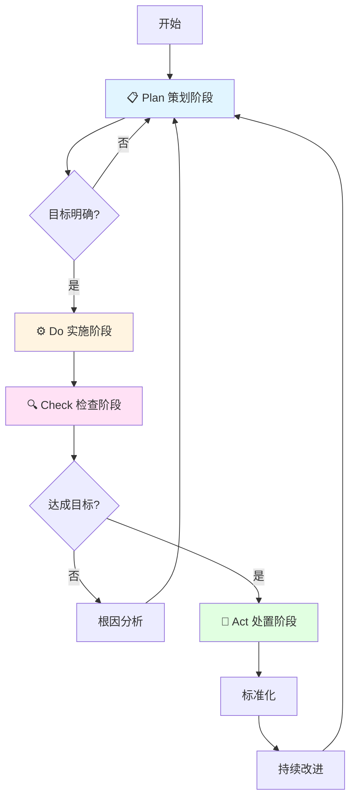

# PDCA循环方法论技能

## 概述

本技能基于ISO9000质量管理体系标准中的PDCA循环理论，指导代理如何使用Plan（策划）、Do（实施）、Check（检查）、Act（处置）四个阶段帮助用户实现持续改进。

## 🚀 快速参考指南

### PDCA循环流程图



### PDCA四阶段速查表

| 阶段 | 英文 | 核心目标 | 关键活动 | 主要输出 |
|------|------|----------|----------|----------|
| 📋 **Plan** | 策划 | 建立目标和过程 | SMART目标设定、WBS分解、SIPOC分析 | 目标说明书、WBS、流程图 |
| ⚙️ **Do** | 实施 | 执行策划方案 | 任务执行、进度跟踪、文档管理 | 执行记录、进度报告、问题清单 |
| 🔍 **Check** | 检查 | 监视和测量结果 | 结果验证、偏差分析、5WHY根因分析 | 检查报告、偏差分析表、根因记录 |
| 🔄 **Act** | 处置 | 持续改进绩效 | 经验总结、标准化、制定改进措施 | 经验总结、标准化文件、改进计划 |

### 核心工具速查

| 工具 | 用途 | 应用阶段 |
|------|------|----------|
| **SMART** | 目标设定 | Plan |
| **WBS** | 任务分解 | Plan |
| **SIPOC** | 过程分析 | Plan |
| **5WHY** | 根因分析 | Check |
| **SWOT** | 风险识别 | Plan |
| **MECE** | 分类穷尽 | Plan/Check |

### 触发关键词

当用户提到以下关键词时，本技能自动激活：
- `PDCA`、`PDCA循环`、`戴明环`
- `持续改进`、`质量管理`
- `项目策划`、`问题解决`、`流程改进`

## 使用指南

### 何时使用本技能

本技能应在以下情况自动激活：
- 用户明确提到"PDCA"、"PDCA循环"、"戴明环"
- 用户需要进行"持续改进"、"质量管理"
- 用户要求"按照PDCA方法论"开展工作
- 用户进行项目策划、问题解决、流程改进

### 如何使用本技能

代理应按照以下步骤使用本技能：

1. **识别当前阶段**：判断用户处于PDCA哪个阶段
2. **提供阶段指导**：给出该阶段的关键活动和输出物
3. **引导下一阶段**：完成当前阶段后，引导用户进入下一阶段
4. **形成闭环**：确保帮助用户完成完整的PDCA循环

### 工作流程

```
用户请求 → 识别阶段 → 提供指导 → 执行任务 → 验证结果 → 持续改进
    ↑                                                        ↓
    ←←←←←←←←←←←←←←←←←←←←←←←←←←←←←←←←←←←←←←←←←←←←←←←←←←←←←←←←←←←
```

### 工作目录管理

PDCA技能运行时，会在项目根目录创建`.pdca/`文件夹，用于存储PDCA运行过程产生的**输出文件**。

#### 目录结构

**输出目录（.pdca/）**：

```
项目根目录/
└── .pdca/
    ├── issue-list.md          # 问题索引列表
    └── issues/                # 问题文件夹
        ├── is-20260409-143000/  # 问题1
        │   ├── README.md      # 问题概述
        │   ├── plan/          # Plan阶段文件
        │   ├── do/            # Do阶段文件
        │   ├── check/         # Check阶段文件
        │   └── act/           # Act阶段文件
        └── is-20260409-150000/  # 问题2
            └── ...
```

**过程规范目录（.trae/skills/pdca/）**：

```
.trae/skills/pdca/
├── templates/                 # 模板文件夹（过程规范）
│   ├── issue-template.md      # 问题概述模板
│   ├── plan-template.md       # Plan阶段模板
│   ├── do-template.md         # Do阶段模板
│   ├── check-template.md      # Check阶段模板
│   └── act-template.md        # Act阶段模板
├── references/                # 参考文档
└── assets/                    # 资产文件
```

#### SIPOC分析

| 供方 (Supplier) | 输入 (Input) | 过程 (Process) | 输出 (Output) | 顾客 (Customer) |
|----------------|--------------|----------------|---------------|----------------|
| PDCA技能 | 用户需求 | PDCA方法论（含模板） | `.pdca/`文件夹中的过程文件 | 用户 |

**说明**：
- **过程规范**（模板文件）：位于`.trae/skills/pdca/templates/`
- **输出文件**（过程文件）：位于`.pdca/`文件夹中

#### 文件命名规范

**问题文件夹命名**：`is-yyyyMMdd-HHmmss`
- `is`：Issue（问题）的缩写
- `yyyyMMdd`：日期（年月日）
- `HHmmss`：时间（时分秒）
- 示例：`is-20260409-143000`

**过程文件命名**：
- Plan阶段：`plan-YYYYMMDD-HHMMSS.md`
- Do阶段：`do-YYYYMMDD-HHMMSS.md`
- Check阶段：`check-YYYYMMDD-HHMMSS.md`
- Act阶段：`act-YYYYMMDD-HHMMSS.md`

#### 问题索引列表

`issue-list.md`文件以表格形式记录所有问题：

| 问题ID | 问题描述 | 创建时间 | 状态 | 优先级 | 文件夹路径 |
|--------|----------|----------|------|--------|-----------|
| IS-001 | 问题描述 | 2026-04-09 14:30:00 | 进行中 | 高 | [is-20260409-143000](./issues/is-20260409-143000/) |

#### 使用流程

1. **创建问题文件夹**：当用户提出新问题时，创建`is-yyyyMMdd-HHmmss/`文件夹
2. **创建问题概述**：在问题文件夹中创建`README.md`，记录问题基本信息
3. **创建PDCA过程文件**：在相应阶段文件夹中创建过程文件
4. **更新问题索引**：在`issue-list.md`中添加或更新问题记录
5. **更新问题状态**：随着PDCA循环进展，及时更新问题状态

## 核心方法论

### Plan（策划）阶段

**目标**：根据顾客要求和组织方针，建立提供结果的目标和过程

**关键活动**：
1. **目标设定（SMART原则）**：明确具体、可衡量、可实现、相关、有时限的目标
2. **工作分解（WBS）**：将总目标分解为里程碑和工作包
3. **过程分析（SIPOC）**：分析供方、输入、过程、输出、顾客

**输出物**：目标说明书、WBS、流程图、资源需求计划

### Do（实施）阶段

**目标**：按照策划方案执行过程

**关键活动**：
1. **任务执行**：按照WBS工作包逐一执行
2. **进度跟踪**：监控里程碑完成情况
3. **文档管理**：记录执行过程，收集证据材料

**输出物**：执行记录、进度报告、问题清单、变更请求

### Check（检查）阶段

**目标**：根据方针、目标和产品要求，对过程和产品进行监视和测量

**关键活动**：
1. **结果验证**：对照目标检查实际结果
2. **偏差分析**：识别实际与计划的差异
3. **根因分析（5WHY）**：连续追问"为什么"，找到根本原因

**输出物**：检查报告、偏差分析表、根因分析记录、数据统计报表

### Act（处置）阶段

**目标**：采取措施，以持续改进过程绩效

**关键活动**：
1. **经验总结**：提炼成功经验，记录失败教训
2. **标准化**：将成功做法标准化，更新相关文档
3. **持续改进**：制定改进措施，进入下一个PDCA循环

**输出物**：经验总结报告、标准化文件、改进计划、知识库更新

## 应用场景

### 场景一：项目管理

**Plan**：制定项目章程、WBS、进度计划
**Do**：执行项目任务、监控进度
**Check**：阶段评审、验收测试
**Act**：项目总结、经验归档

### 场景二：问题解决

**Plan**：定义问题、分析原因、制定对策
**Do**：实施改进措施
**Check**：验证效果、确认根因消除
**Act**：标准化、预防再发

### 场景三：流程改进

**Plan**：识别改进机会、设定改进目标
**Do**：实施新流程、培训人员
**Check**：评估流程绩效、收集反馈
**Act**：固化流程、持续优化

## 注意事项

1. **闭环思维**：必须完成完整的PDCA循环，不能只做前两个阶段
2. **数据驱动**：检查阶段必须基于客观数据，不能主观臆断
3. **持续改进**：处置阶段要为下一循环设定更高目标
4. **全员参与**：鼓励团队成员参与PDCA各阶段
5. **文档记录**：每个阶段都要形成规范的文档记录

## 📚 参考文档

本技能包含以下详细参考文档，按需加载：

- **[理论基础](references/theory.md)**：PDCA理论详解、四个阶段详细说明、配套工具方法
- **[完整示例](references/example.md)**：代码审查流程改进的完整PDCA循环案例
- **[实用模板](references/templates.md)**：SMART目标模板、WBS模板、SIPOC模板、5WHY模板
- **[检查清单](references/checklists.md)**：Plan、Do、Check、Act各阶段检查清单
- **[度量指标](references/metrics.md)**：效果度量指标、过程度量指标、使用指南
- **[常见问题](references/faq.md)**：12个常见问题解答
- **[术语表](references/glossary.md)**：PDCA术语中英文对照，107个专业术语

## 快速开始

### 第一次使用PDCA技能

代理应按照以下步骤使用本技能：

1. **了解基础**：阅读本文件的快速参考指南
2. **查看示例**：参考 [完整示例](references/example.md) 了解如何帮助用户应用PDCA
3. **使用模板**：使用 [实用模板](references/templates.md) 帮助用户开始第一个PDCA循环
4. **检查完整性**：使用 [检查清单](references/checklists.md) 确保每个阶段完整

### 常用操作

**开始一个PDCA循环**：
```
用户：我想用PDCA方法改进[项目/流程/问题]
代理：按照PDCA四阶段帮助用户开展工作
```

**查看某个阶段的详细指导**：
```
用户：告诉我Plan阶段应该做什么
代理：提供Plan阶段的关键活动、输出物和注意事项
```

**获取模板或检查清单**：
```
用户：给我一个SMART目标模板
代理：提供SMART目标设定模板，或引用 references/templates.md
```

## 参考资料

- ISO 9000:2015 质量管理体系 基础和术语
- ISO 9001:2015 质量管理体系 要求
- 戴明《走出危机》
- 《质量管理学》
- [AgentSkills规范](https://agentskills.io/specification)
