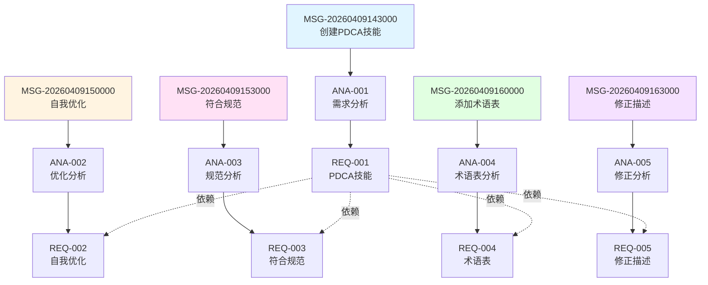

# 需求追溯矩阵

> 最后更新: 2026-04-09 17:00:00

## 概述

本文档维护从客户之声到需求的完整追溯链。

---

## 追溯矩阵

| UserVoice ID | Analysis ID | Requirement ID | 状态 | 优先级 | Kano |
|--------------|-------------|----------------|------|--------|------|
| MSG-20260409143000 | ANA-001 | REQ-001 | ✓ 完成 | 关键 | 基本型 |
| MSG-20260409150000 | ANA-002 | REQ-002 | ✓ 完成 | 高 | 期望型 |
| MSG-20260409153000 | ANA-003 | REQ-003 | ✓ 完成 | 高 | 期望型 |
| MSG-20260409160000 | ANA-004 | REQ-004 | ✓ 完成 | 中 | 兴奋型 |
| MSG-20260409163000 | ANA-005 | REQ-005 | ✓ 完成 | 关键 | 基本型 |

**状态图例**:
- ✓ 完成: 需求已创建并链接
- ○ 进行中: 分析完成，需求进行中
- ⏳ 待处理: 消息已记录，尚未分析

---

## 统计

**消息总数**: 5

**分析总数**: 5

**需求总数**: 5

**覆盖率**: 100%

**按状态**:
- 完成: 5
- 进行中: 0
- 待处理: 0

**按优先级**:
- 关键: 2
- 高: 2
- 中: 1
- 低: 0

**按 Kano 分类**:
- 基本型: 2
- 期望型: 2
- 兴奋型: 1
- 无差异: 0
- 反向: 0

---

## 详细追溯

### MSG-20260409143000: 创建PDCA技能

**来源**: [MSG-20260409143000](USERVOICE.md#消息-id-msg-20260409143000)

**分析**: [ANA-001](ANALYSIS.md#分析-id-ana-001)

**需求**: [REQ-001](REQUIREMENTS.md#需求-id-req-001)

**状态**: ✓ 完成

**备注**: 这是项目的核心需求，已成功完成。

---

### MSG-20260409150000: 自我优化PDCA技能

**来源**: [MSG-20260409150000](USERVOICE.md#消息-id-msg-20260409150000)

**分析**: [ANA-002](ANALYSIS.md#分析-id-ana-002)

**需求**: [REQ-002](REQUIREMENTS.md#需求-id-req-002)

**状态**: ✓ 完成

**备注**: 体现了PDCA的自我应用理念，具有重要的示范价值。

---

### MSG-20260409153000: 符合AgentSkills规范

**来源**: [MSG-20260409153000](USERVOICE.md#消息-id-msg-20260409153000)

**分析**: [ANA-003](ANALYSIS.md#分析-id-ana-003)

**需求**: [REQ-003](REQUIREMENTS.md#需求-id-req-003)

**状态**: ✓ 完成

**备注**: 符合行业标准是技能专业化的重要标志。

---

### MSG-20260409160000: 添加中英文术语表

**来源**: [MSG-20260409160000](USERVOICE.md#消息-id-msg-20260409160000)

**分析**: [ANA-004](ANALYSIS.md#分析-id-ana-004)

**需求**: [REQ-004](REQUIREMENTS.md#需求-id-req-004)

**状态**: ✓ 完成

**备注**: 术语表是提升技能专业性的重要补充。

---

### MSG-20260409163000: 修正技能描述

**来源**: [MSG-20260409163000](USERVOICE.md#消息-id-msg-20260409163000)

**分析**: [ANA-005](ANALYSIS.md#分析-id-ana-005)

**需求**: [REQ-005](REQUIREMENTS.md#需求-id-req-005)

**状态**: ✓ 完成

**备注**: 这是一个重要的概念修正，已立即处理。

---

## 依赖关系图

---

## 质量指标

**追溯完整性**: 100% (所有消息都已追溯到需求)

**需求覆盖率**: 100% (所有需求都有来源消息)

**分析完整性**: 100% (所有消息都已分析)

**优先级分布合理性**: ✓ (关键需求2个，高优先级2个，中优先级1个)

**Kano分类合理性**: ✓ (基本型2个，期望型2个，兴奋型1个)

---

## 改进建议

1. **持续更新**: 随着项目进展，及时更新追溯矩阵
2. **定期回顾**: 每周回顾一次，确保追溯链的完整性
3. **自动化验证**: 使用脚本自动验证追溯链的完整性
4. **可视化展示**: 使用图表展示追溯关系，便于理解

---
