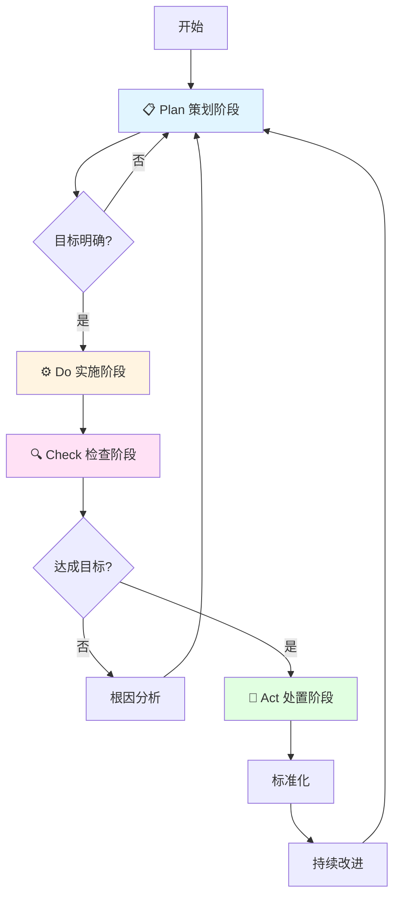

# PDCA循环方法论技能

## 📋 快速导航

- [概述](#概述) - 技能简介与核心价值
- [🚀 快速参考](#-快速参考指南) - 流程图、速查表、触发词
- [使用方法](#使用指南) - 何时使用、工作流程、目录管理
- [核心方法论](#核心方法论) - PDCA四阶段详解
- [🎯 场景模板](#-场景化模板) - 5个专用场景模板
- [📚 参考文档](#-参考文档) - 理论、示例、模板、清单等
- [快速开始](#快速开始) - 第一次使用指南

---

## 概述

本技能基于ISO9000质量管理体系标准中的PDCA循环理论，指导AI代理按照**Plan（策划）**、**Do（实施）**、**Check（检查）**、**Act（处置）**四个阶段系统化开展工作，帮助用户实现持续改进。

**核心价值**：
- ✅ 系统化的问题解决框架
- ✅ 数据驱动的决策方法
- ✅ 持续改进的闭环思维
- ✅ 标准化的过程管理

**详细理论请参考**: [references/theory.md](references/theory.md)

## 🚀 快速参考指南

### PDCA循环流程图



### PDCA四阶段速查表

| 阶段 | 英文 | 核心目标 | 关键活动 | 主要输出 |
|------|------|----------|----------|----------|
| 📋 **Plan** | 策划 | 建立目标和过程 | SMART目标设定、WBS分解、SIPOC分析 | 目标说明书、WBS、流程图 |
| ⚙️ **Do** | 实施 | 执行策划方案 | 任务执行、进度跟踪、文档管理 | 执行记录、进度报告、问题清单 |
| 🔍 **Check** | 检查 | 监视和测量结果 | 结果验证、偏差分析、5WHY根因分析 | 检查报告、偏差分析表、根因记录 |
| 🔄 **Act** | 处置 | 持续改进绩效 | 经验总结、标准化、制定改进措施 | 经验总结、标准化文件、改进计划 |

### 核心工具速查

| 工具 | 用途 | 应用阶段 |
|------|------|----------|
| **SMART** | 目标设定 | Plan |
| **WBS** | 任务分解 | Plan |
| **SIPOC** | 过程分析 | Plan |
| **5WHY** | 根因分析 | Check |
| **SWOT** | 风险识别 | Plan |
| **MECE** | 分类穷尽 | Plan/Check |

### 触发关键词

当用户提到以下关键词时，本技能自动激活：
- `PDCA`、`PDCA循环`、`戴明环`
- `持续改进`、`质量管理`
- `项目策划`、`问题解决`、`流程改进`

## 使用指南

### 何时使用本技能

本技能应在以下情况自动激活：
- 用户明确提到"PDCA"、"PDCA循环"、"戴明环"
- 用户需要进行"持续改进"、"质量管理"
- 用户要求"按照PDCA方法论"开展工作
- 用户进行项目策划、问题解决、流程改进

### 如何使用本技能

代理应按照以下步骤使用本技能：

1. **识别当前阶段**：判断用户处于PDCA哪个阶段
2. **提供阶段指导**：给出该阶段的关键活动和输出物
3. **引导下一阶段**：完成当前阶段后，引导用户进入下一阶段
4. **形成闭环**：确保帮助用户完成完整的PDCA循环

### 工作流程

```
用户请求 → 识别阶段 → 提供指导 → 执行任务 → 验证结果 → 持续改进
    ↑                                                        ↓
    ←←←←←←←←←←←←←←←←←←←←←←←←←←←←←←←←←←←←←←←←←←←←←←←←←←←←←←←←←←←
```

**AI代理工作要点**：
1. **主动引导**：每完成一个阶段，主动询问是否进入下一阶段
2. **数据驱动**：Check阶段必须要求用户提供客观数据
3. **闭环思维**：确保Act阶段形成标准化和改进计划
4. **文档记录**：引导用户在.pdca/目录中记录完整过程

### 工作目录管理

**详细说明请参考**: [references/directory-management.md](references/directory-management.md)

PDCA技能运行时，会在项目根目录创建`.pdca/`文件夹存储输出文件，在技能安装目录的`templates/`中存放模板。

**核心要点**：
- **输出目录**: `.pdca/issues/issue-yyyyMMdd-HHmmss/`
- **文件命名**: `issue-20260409-143000`（使用实际时间）
- **问题索引**: `issue-list.md`记录所有问题
- **重要提示**: 必须使用实际当前时间，格式为`yyyyMMdd-HHmmss`

## 核心方法论

**详细说明请参考**: [references/theory.md](references/theory.md)

### 📋 Plan（策划）阶段

**目标**：建立目标和过程

**关键活动**：
1. **SMART目标设定** - 具体、可衡量、可实现、相关、有时限
2. **WBS工作分解** - 将目标分解为里程碑和工作包
3. **SIPOC过程分析** - 供方、输入、过程、输出、顾客

**输出物**：目标说明书、WBS、流程图、资源计划

**检查清单**: [references/checklists.md#plan阶段检查清单](references/checklists.md#plan阶段检查清单)

---

### ⚙️ Do（实施）阶段

**目标**：执行策划方案

**关键活动**：
1. **任务执行** - 按WBS逐一执行
2. **进度跟踪** - 监控里程碑完成情况
3. **文档管理** - 记录执行过程，收集证据

**输出物**：执行记录、进度报告、问题清单

**检查清单**: [references/checklists.md#do阶段检查清单](references/checklists.md#do阶段检查清单)

---

### 🔍 Check（检查）阶段

**目标**：监视和测量结果

**关键活动**：
1. **结果验证** - 对照目标检查实际结果
2. **偏差分析** - 识别实际与计划的差异
3. **5WHY根因分析** - 连续追问找到根本原因

**输出物**：检查报告、偏差分析表、根因记录

**检查清单**: [references/checklists.md#check阶段检查清单](references/checklists.md#check阶段检查清单)

---

### 🔄 Act（处置）阶段

**目标**：持续改进绩效

**关键活动**：
1. **经验总结** - 提炼成功经验，记录失败教训
2. **标准化** - 将成功做法标准化，更新文档
3. **持续改进** - 制定改进措施，进入下一循环

**输出物**：经验总结、标准化文件、改进计划

**检查清单**: [references/checklists.md#act阶段检查清单](references/checklists.md#act阶段检查清单)

## 🎯 场景化模板

**详细使用说明请查看**: [templates/README.md](templates/README.md)

### 可用场景模板

| 场景 | 模板路径 | 特点 |
|------|----------|------|
| 🐛 BUG修复 | `scenarios/bugfix/template.md` | 强调根因分析和回归测试 |
| 💻 功能开发 | `scenarios/feature-dev/template.md` | 从用户故事到完整实现 |
| 📋 制定计划 | `scenarios/software-plan/template.md` | **纯文档输出**，不涉及代码 |
| 🔍 代码审查 | `scenarios/code-review/template.md` | 多维度质量检查 |
| ⚡ 性能优化 | `scenarios/performance-opt/template.md` | ROI分析和可持续性评估 |

### 通用阶段模板

当没有合适的场景模板时，使用通用模板：

| 阶段 | 模板路径 |
|------|----------|
| Plan | `generic/plan-template.md` |
| Do | `generic/do-template.md` |
| Check | `generic/check-template.md` |
| Act | `generic/act-template.md` |

### 模板选择建议

1. **优先使用场景模板** - 获得更针对性的指导和检查清单
2. **参考示例文件** - 部分场景提供了实际案例（如BUG修复）
3. **阅读场景说明** - 某些场景有特殊注意事项
4. **灵活组合使用** - 可以根据需要组合不同模板的元素

---

## ⚠️ 注意事项

1. **闭环思维** - 必须完成完整的PDCA循环，不能只做前两个阶段
2. **数据驱动** - Check阶段必须基于客观数据，不能主观臆断
3. **持续改进** - Act阶段要为下一循环设定更高目标
4. **全员参与** - 鼓励团队成员参与PDCA各阶段
5. **文档记录** - 每个阶段都要形成规范的文档记录

## 📚 参考文档

**详细索引请参考**: [references/README.md](references/README.md)

本技能包含以下参考文档，按需加载：

| 文档 | 内容 | 适用场景 |
|------|------|----------|
| **[理论基础](references/theory.md)** | PDCA理论详解、四阶段说明、配套工具 | 深入学习方法论 |
| **[完整示例](references/example.md)** | 代码审查流程改进的完整案例 | 了解实际应用 |
| **[目录管理](references/directory-management.md)** | 工作目录结构、文件命名、使用流程 | 管理.pdca/目录 |
| **[实用模板](references/templates.md)** | SMART、WBS、SIPOC、5WHY等工具模板 | 直接使用工具 |
| **[检查清单](references/checklists.md)** | 四阶段检查清单 | 确保阶段完整性 |
| **[度量指标](references/metrics.md)** | 效果和过程度量指标 | 评估实施效果 |
| **[常见问题](references/faq.md)** | 12个常见问题解答 | 解决使用疑问 |
| **[术语表](references/glossary.md)** | 107个专业术语中英文对照 | 查阅专业术语 |

## 快速开始

### 第一次使用PDCA技能

**推荐学习路径**：
1. **了解基础** - 阅读本文件的[快速参考指南](#-快速参考指南)
2. **查看示例** - 参考 [完整示例](references/example.md) 了解实际应用
3. **使用模板** - 使用 [场景模板](templates/README.md) 开始第一个PDCA循环
4. **检查完整性** - 使用 [检查清单](references/checklists.md) 确保各阶段完整

### 常用交互模式

**模式1：开始新的PDCA循环**
```
用户：我想用PDCA方法改进[项目/流程/问题]
代理：
  1. 确认问题和目标
  2. 初始化.pdca/目录（如需要）
  3. 创建问题文件夹和索引
  4. 引导进入Plan阶段
```

**模式2：继续进行中的PDCA循环**
```
用户：继续之前的PDCA循环 / 现在进入Check阶段
代理：
  1. 定位到对应的问题文件夹
  2. 加载上一阶段的输出
  3. 提供当前阶段的指导
  4. 创建当前阶段的过程文件
```

**模式3：查询特定工具或模板**
```
用户：给我一个SMART目标模板 / 如何做5WHY分析
代理：
  1. 提供简明的工具说明
  2. 引用对应的模板文件或参考文档
  3. 给出实际应用建议
```

### AI代理对话引导示例

**Plan阶段引导**：
```
让我们开始Plan阶段。首先，请告诉我：
1. 当前面临的主要问题是什么？
2. 希望通过PDCA达到什么目标？（我们将用SMART原则来明确）
3. 有哪些约束条件或资源限制？
```

**Check阶段引导**：
```
现在进入Check阶段。请提供：
1. 实际达成的结果数据
2. 与目标的对比情况
3. 遇到的主要问题和偏差

我将帮您进行偏差分析和根因分析。
```

**Act阶段引导**：
```
最后进入Act阶段。让我们：
1. 总结本次PDCA的成功经验和教训
2. 确定哪些做法可以标准化
3. 为下一个PDCA循环设定更高的目标
```

---

## 参考资料

- ISO 9000:2015 质量管理体系 基础和术语
- ISO 9001:2015 质量管理体系 要求
- 戴明《走出危机》
- 《质量管理学》
- [AgentSkills规范](https://agentskills.io/specification)
